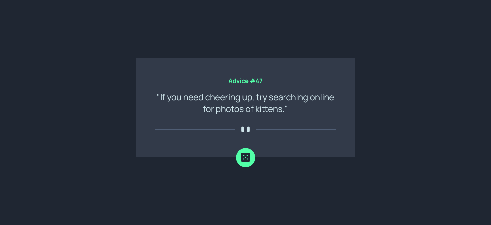
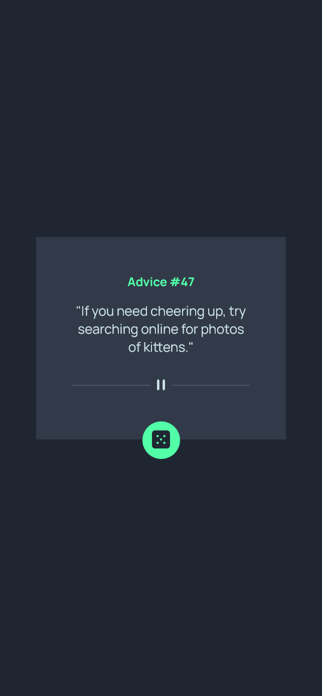

# Advice generator app

A simple and fully responsive web application that generates random advice using HTML, CSS, and JavaScript. The app fetches data from the [Advice Slip API](https://api.adviceslip.com/) and displays it in an aesthetically pleasing and user-friendly interface.

The app is built using a mobile-first approach and optimized for different screen sizes. Flexbox and media queries are used to ensure responsiveness.

This app uses the Advice Slip API to fetch random advice. The data is retrieved using a simple fetch request in JavaScript.

##### API Response:

```
{
  "slip": {
    "id": 42,
    "advice": "Don't forget to take breaks while working."
  }
}
```
---

## Features

- 🎲 **Random Advice**: Generate random pieces of advice at the click of a button.
- 📱 **Fully Responsive**: Designed to look great on any device, from mobile phones to desktops.
- ✨ **Clean UI**: A minimalist and intuitive design for a seamless user experience.
- ⚡ **Fast and Lightweight**: Loads quickly and performs efficiently.

---

## Live Demo

Check out the live app: [Advice Generator App](https://gleaming-starlight-a21acf.netlify.app/)

---

## Technologies Used

- **HTML5**: For structuring the application.
- **CSS3**: For styling and ensuring responsiveness.
- **JavaScript**: For fetching data from the API and adding interactivity.

---

## How to Run Locally

1. **Clone the Repository**:
   ```bash
   git clone https://github.com/clinton15/advice-generator-app.git
   cd advice-generator-app

2. **Open in the Browser**: 
Simply open the index.html file in your browser to see the app in action.

---

### Screenshots

#### Desktop View:



#### Mobile View:



---

### Built with

- Semantic HTML5 markup
- CSS custom properties
- Flexbox
- Mobile-first workflow
- Fetch API

---

### What I learned

In this project, I learned how to use CSS variables to make styles more flexible and maintainable. By defining variables for colors, I can easily reuse them throughout the stylesheet, ensuring consistency and simplifying updates. When a change is needed, I can update the variable once, and it automatically reflects across all instances where the variable is used. This improves code readability and reduces duplication.

```html
:root {
  --green: hsl(150, 100%, 66%);
}
```
```css
.dice-btn:hover {
  box-shadow: 0 0 16px var(--green);
}
```

---

### Continued development

- **Preferences and Filters:** Allow users to set preferences, such as receiving advice on specific topics (e.g., career, relationships, personal growth) and avoid advice in other areas they’re not interested in.
- **Multilingual Support:** Expand the app’s reach by adding multilingual support, enabling users from various regions to access advice in their native languages.
- **Offline Mode:** Allow users to access advice even when they are offline or in areas with limited connectivity. Store recent advice in cache for access without an internet connection.

---

### Useful resources

- [MDN](https://developer.mozilla.org/en-US/) - This was my guide for any blockers/issues that i faced during the development phase. It covers a variety of concepts and i will use it going forward.
- [Use of CSS Variables](https://www.w3schools.com/css/css3_variables.asp) - This is an amazing article which helped me finally understand how to add CSS variables in our code. I'd recommend it to anyone still learning this concept.

---

## Author

- [Clinton Pereira](https://www.your-site.com)
